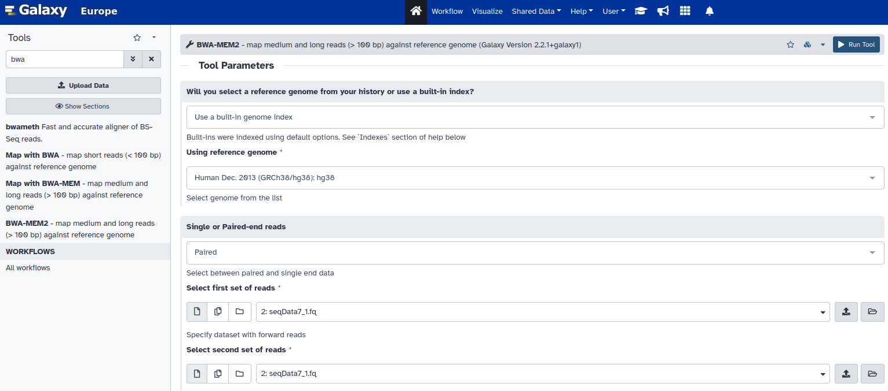

```{r setup, include=FALSE}
# Parametrizamos
require(knitr)
# include this code chunk as-is to set options
opts_chunk$set(comment = NA, prompt = TRUE, tidy = FALSE, 
               fig.width = 7, fig.height = 7, echo = params$printcode, 
               message = FALSE, warning = FALSE, cache=FALSE)
Sys.setlocale("LC_TIME", "C")
```

-----------------------------------------------------------

# Abstract

En esta práctica vamos a utilizar distintas herramientas incluidas en el 
software [Galaxy](https://usegalaxy.org/) con el objetivo de obtener los datos 
de lectura de NGS con los archivos que se proporcionan y realizar un flujo de
trabajo para la detección de pequeñas variantes (SNPs). Alinearemos nuestras 
lecturas  con un genoma de referencia, en nuestro caso *human (hg38)*, 
buscaremos diferencias entre las lecturas alineadas y la secuencia 
del genoma de referencia, filtraremos la variación genómica detectada y 
anotaremos nuestras variantes.

# Introducción y Objetivos

El objetivo de esta actividad es realizar un análisis de variantes minoritarias 
siguiendo una metodología similar a la expuesta en los ejemplos proporcionados 
en los materiales de estudio.
Realizaremos la identificación de pequeñas variantes (SNVs/indels) en el ADN 
genómico humano, utilizando datos obtenidos del proyecto de los 1000 genomas,
accesible a través del repositorio [ISGR](https://www.internationalgenome.org/).
Para ello descargaremos y manipularemos unos datos de NGS, realizaremos un 
control de calidad, alinearemos los reads al genoma de referencia, miraremos las
diferencias entre las secuencias alineadas y el genoma de referencia, 
visualizaremos los archivos del alineamiento con un visor de genoma, haremos 
un filtrado de las variantes y anotaremos las mismas.
  
Finalmente, presentaremos en este informe los resultados obtenidos y los 
valoraremos haciendo una discusón del estudio y las limitaciones halladas.


# Material y Métodos  {.tabset .tabset-fade .tabset-pills}

Los datos de ADN genómico humano que se ha proporcionado para la realicación de 
la práctica se han obtenidos del proyecto de los 1000 genomas, accesible a 
través del repositorio [ISGR](https://www.internationalgenome.org/).
  
Las muestras con las que trabajaremos están formadas por dos archivos de 
secuencias aparejados *"Paired End reads"*. 

De estos datos se han extraído aleatoriamente 10 conjuntos de secuencias de cada
pareja de archivos fastq. Con ellos se han generado diez pares de archivos con 
las mismas secuencias, seleccionadas también de forma aleatoria.  
En nuestro caso los dos archivos con los que trabajaremos son *seqData7_1.fq* y 
*seqData7_2.fq*.

Los datos pertenecen al exoma del genoma humano. Cada archivo tiene 1.000.000 
de secuencias de 101 pb cada una. *seqData7_1.fq* contiene los datos de la hebra
5'a 3' ("forward") y el *seqData7_2.fq* de la hebra complementaria 3'a 5' 
("reverse").  

  
## Carga de datos

Lo primero que hacemos es cargar en *Galaxy* los datos crudos (raw) los dos 
archivos fastq que nos han proporcionado desde nuestro ordenador.    
Una vez tenemos las secuencias cargadas en *Galaxy* podemos empezar a trabajar 
con ellas y realizar nuestro análisis.

```{r, out.width='100%', fig.align='center', echo = FALSE}

```

## Control de Calidad

Para hacer el control de calidad utilizaremos el programa *FastQC* que ya viene 
integrado en *Galaxy*.
El uso de *FastQC* en *Galaxy* es fácil. Una vez cargados los datos de 
secuenciación de cada archivo por separado, realiza un informe de cada uno de 
ellos en el que aparecen distintas gráficas y estadísticas con las que se hace 
una valoración de la calidad de los datos de varias formas distintas.  
Una herramienta muy útil es *MultiQC* que nos auna los resultados obtenidos 
por FastQC de cada archivo y nos da un único output que facilita el control de
calidad.  
  
En este caso he optado por incorporar las imágenes de las gráficas generadas 
para nuestros datos.  

**General Statistics ** 

MultiQC nos ofrece este informe en el que nos aporta información sobre varios 
aspectos del archivo con las secuencias.  
Vemos que el formato de los archivos es en *fastqc* (.fq), contiene 1.000.000 de 
secuencias de un tamaño de 101 pb cada una.  

```{r, out.width='65%', fig.align='center', echo = FALSE}

```

**Sequence Counts**

```{r, out.width='50%', fig.align='center', echo = FALSE}

```

**Sequence quality **

La calidad de la secuencia es buena.

```{r, out.width='50%', fig.align='center', echo = FALSE}

```

**Per sequence quality scores **

Las puntuaciones de calidad por secuencia son buenas.

```{r, out.width='50%', fig.align='center', echo = FALSE}

```
  
**Per sequence GC content **

Vemos que el contenido de GC por secuencia no está del todo bien y no coincide 
con el teórico.

```{r, out.width='50%', fig.align='center', echo = FALSE}

```

**Per base N content **

El contenido de %N por base es bueno.

```{r, out.width='50%', fig.align='center', echo = FALSE}

```

**Sequence Length Distribution **

La distribución de la longitud de la secuencia es de 101 pb.

```{r, out.width='80%', fig.align='center', echo = FALSE}

```

**Sequence Duplication Levels **

Los niveles de duplicación de secuencia no son buenos.

```{r, out.width='50%', fig.align='center', echo = FALSE}

```

**Adapter Content **

```{r, out.width='50%', fig.align='center', echo = FALSE}

```

**Status Checks **

```{r, out.width='50%', fig.align='center', echo = FALSE}

```
  
Vemos que los resultados de las muestras son de calidad por lo que podemos 
continuar con nuestro análisis.  


## Alineación de los "reads" con el genoma

Procedemos a alinear nuestras secencias con un genoma de referencia. El programa
de alineamiento que vamos a utilizar es **BWA**. En concreto, vamos a utilizar
uno de los alineadores que ofrece *Galaxy*, *BWA-MEM-2* que mapea lecturas 
medias y largas (> 100 pb), las nuestras son de 101 pb, contra un genoma de 
referencia. Nosotros utilizaremos el *Human (GRCh38/hg38)*. 
Cabe comentar que, dado que tenemos *"Paired End reads"*, utilizaremos por un 
lado los dos archivos .fq y por otro la opción "Pared" para que nuestro 
alineador lo tenga en cuenta.


```{r, out.width='100%', fig.align='center', echo = FALSE}

```

Una vez terminada la alineación obtenemos una serie de secuencias alineadas 
guardadas en un archivo BAM.  
Podemos visualizar el archivo .BAM en el propio *Galaxy*.  

```{r, out.width='100%', fig.align='center', echo = FALSE}

```

## Calidad del alineamiento

Una vez realizado el alineamiento revisamos la calidad del mismo. Utilizaremos 
la herramienta *idxstats* (es una Samtool) que nos permite realizar unas 
estadísticas sobre el alineamiento Sam. 
  
```{r, out.width='100%', fig.align='center', echo = FALSE}

```
  
Obtenemos el siguiente informe:  
  
```{r, out.width='50%', fig.align='center', echo = FALSE}

```
    
  
En la tabla tenemos una serie de columnas cuya descripción és:
  
1 Identificador de secuencia de referencia  
2 Longitud de la secuencia de referencia  
3 Número de lecturas asignadas  
4 Número de lecturas colocadas pero no asignadas  

En la imagen solo se muestra una parte del informe. En él comprobamos que 
aparecen alineamientos en todos los cromosomas por lo que suponemos que 
las secuencias pertenecían a todo el exoma.  
En el cromosoma en el que más alineamientos obtenemos es en el cromosoma 1 (*Chr1*)
con un total de 216.557 secuencias asociadas al mismo, casi un 10,8% del total. 
En el resto de cromosomas obtenemos diferentes cantidades de alineamientos 
pero en todo caso inferiores a las del *Chr1*.  

Dado que no tenemos ninguna otra indicación del problema o estudio que se 
nos plantea, asumimos que estamos intentando encontrar variantes minoritarias 
en algún gen o genes del cromosoma 1.

## Visualización de los archivos BAM

Podemos visualizar el alineamiento utilizando un programa de visualización 
genómica; en nuestro caso utilizaremos **igv** (*Integrated Genome Viewer*).  

Como hemos comentado, no tenemos ninguna indicación de dónde ir a buscar los 
alineamientos así que decidimos centramos en una región del cromosoma 1, en 
concreto en el gen *CDK11B*.  

```{r, out.width='100%', fig.align='center', echo = FALSE}

```

Los alineamientos en gris son del *strand* "forward" (*seqData7_1.fq*) y los 
blancos del "reverse" (*seqData7_2.fq*).  

Comentar que el "coverage" no es muy alto pero es de los más altos que he podido
observar en relación al resto de alineamientos.

## Selección de variantes

### Valoración de la calidad del alineamiento con pileup

Vamos ha hacer un *pileup*, un resumen del número de secuencias alineadas por 
cada una de las regiones.  
    
```{r, out.width='100%', fig.align='center', echo = FALSE}

```

Obtenemos valores indicativos de un buen resultado.

```{r, out.width='80%', fig.align='center', echo = FALSE}

```

Podemos utilizar un filtro pileup para eliminar aquellas regiones que tengan 
menos de 10 lecturas; estamos quitando del alineamiento aquellas regiones con una 
calidad dudosa.

```{r, out.width='100%', fig.align='center', echo = FALSE}

```

Vemos un output del resultado.

```{r, out.width='80%', fig.align='center', echo = FALSE}

```

### Selección de variantes

Para hacer nuestra selección de variantes utilizaremos el "variant caller" 
*FreeBayes bayesian genetic variant detector*.  
El genoma que hemos utilizado de referencia es el *Human Dec. 2013 
(GRCh38/hg38) (hg38).*

```{r, out.width='100%', fig.align='center', echo = FALSE}

```

Podemos visualizar de nuevo el alineamiento y la selección de variantes 
utilizando **igv**. Como se puede ver, ahora nos aparece una nueva pista con más información como el resultado de FreeBayes que nos ha detectado unas variantes 
en la región de interés.

```{r, out.width='100%', fig.align='center', echo = FALSE}

```

## Filtraje y Anotación de las variantes

### Filtrado

Ahora podemos aplicar un filtro a la región de interés para ver qué variantes se
encuentran en el cromosoma 1 entre las posiciones 1,656,602 y 1,657,956.
  
c1=='chr1' and c2 > 1656602 and c2 < 1657956  

```{r, out.width='100%', fig.align='center', echo = FALSE}
knitr::include_graphics("img/7_1.png")
```

Obtenemos 4 variantes del filtrado.

```{r, out.width='100%', fig.align='center', echo = FALSE}

```
  
Así, hemos podido detectar las variantes y describirlas.
  
A continuación vemos la información desplegada de estas variantes.
  
```{r, out.width='100%', fig.align='center', echo = FALSE}

```

### Anotación  

Una vez detectadas, nos queda anotar las variantes y saber cual es su posible
efecto. Para ello utilizaremos el programa 
[SnpEff](http://snpeff.sourceforge.net/).

```{r, out.width='100%', fig.align='center', echo = FALSE}

```

Podemos ver todos los resultados en el informe html que produce SnpEff.  
Se puede acceder al mismo a través del repositorio de la práctica. 

Adjuntamos unas cuantas imágenes del mismo.

```{r, out.width='75%', fig.align='center', echo = FALSE}

```

```{r, out.width='75%', fig.align='center', echo = FALSE}

```

```{r, out.width='60%', fig.align='center', echo = FALSE}

```
  
Se puede observar en el informe que el mayor número de variantes aparecen en el 
cromosoma 1.

# Resultados {.tabset .tabset-fade .tabset-pills}

Como ya se ha comentado antes, las herramientas que hemos utilizado para
para hacer nuestro análisis han sido las de la suit *Galaxy*.

El control de calidad que hemos realizado sobre los dos archivos de datos que 
se nos han proporcionado, arrojan unos resultados buenos de las muestras.  

Hemos alineado las secuencias con el genoma *Human (GRCh38/hg38)* con 
*BWA-MEM-2* obteniendo el archivo BAM.  

Con *idxstats* hemos realizado unas estadísticas sobre el alineamiento Sam. El 
cromosoma en el que más alineamientos se han obtenemos es el *Chr1*, con un 
total de 216.557, un 10,8%. Debido a esto, hemos asumido que estamos intentando 
encontrar variantes minoritarias en este cromosoma. 
  
Con lo anterior en mente, en aras de hacer nuestro estudio, hemos hecho la 
suposición de que estamos interesados en el gen *CDK11B* por lo que hemos 
visualizado en *igv* la región de este gen.

Para la selección de variantes hemos valorado primero la calidad del 
alineamiento con *pileup* para luego aplicar *FreeBayes bayesian genetic 
variant detector* para las selección de variantes.  
Hemos vuelto ha utilizar *igv* para la visualización de las mismas en la región
de interes.
  
Por último hemos hecho el filtraje de las variantes obtenidas aplicando el 
filtro a la región de interés para ver qué variantes se hallan en el 
cromosoma 1 entre las posiciones 1,656,602 y 1,657,956.  
Hemos obtenido 4 variantes. Tres de estas variantes son SNP's y una es un indel.
Una de las SNP se localiza en un intrón mientras que las restantes variantes se
hallan en un mismo exón.

Para finalizar hemos anotado las variantes con *SnpEff*.    
El archivo que produce SnpEff es un documento HTML con un resumen de las 
anotaciones aplicadas a las variantes observadas. Se pueden ver los tipos de 
variantes, el impacto de las variantes, las regiones funcionales, etc.

# Discusión y Limitaciones

Los resultados que hemos obtenidos con las herramientas de *Galaxy* han arrojado
unos datos de calidad y el hallazgo de 4 variantes minoritarias en una 
región de interés.

Teniendo en cuenta que no teníamos más indicaciones en la práctica, he optado, 
dado que había bastantes secuencias alineadas en la región escogida, hacer la 
hipótesis de que estábamos interesados en esa región del genoma por un supuesto 
estudio sobre el gen *CDK11B* (Cyclin-Dependent Kinase 11B) que codifica para 
una cinasa dependiente de ciclinas. 
  
Las principales funciones de *CDK11B* son: 
  
1- Regulación del ciclo celular  
2- Control de la transcripción  
3- Procesamiento de ARN  
4- Regulación de la apoptosis  
5- Respuesta al estrés celular  
6- Interacciones con otras proteínas  

Siguiendo con esta suposición, nos podríamos aventurar a suponer que, dado su 
papel en procesos celulares tan fundamentales, las alteraciones en la función de
*CDK11B* pueden estar asociadas a ciertos tipos de cáncer. 

Unas de las limitaciones que he encontrado es la falta de información que pudiese 
guiar un poco más el estudio de las variantes. Me ha resultado especialmente 
ardua la tarea de buscar en tanta información en todo el exoma.
  
Comentar también que esta práctica se ha realizado sobre un 10% del total de los
datos que se tenían en un principio, por lo que los procesos habrían sido aún más
arduos dado el elevado coste computacional que hubiesen requerido.

# Coclusiones

He podido hacer un análisis de variantes minoritarias en exomas siguiendo la 
metodología proporcionada en la asignatura y utilizando las herramientas 
bioinformáticas de *Galaxy*.  
Ha siddo un trayecto muy didáctico dado que cada fase del análisis no ha sido
para nada trivial. Además, he tenido que plantear una hipóteisi de trabajo para
dar coherencia al análisis.  
Por último, se ha podido llagar a un filtraje de 4 variantes y hacer la anotación 
de las mismas para ver su posible efecto cerrando, de esta manera, todo el ciclo
del análisis de variantes.

# Referencias
  
